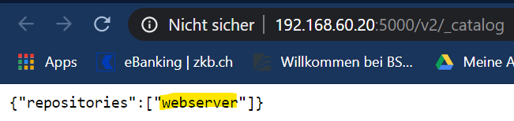
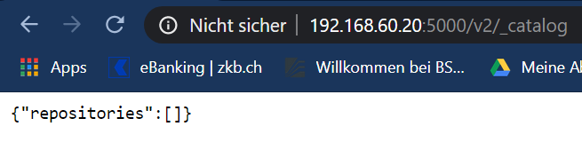
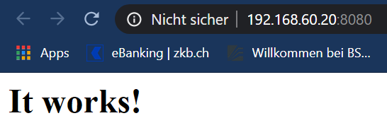
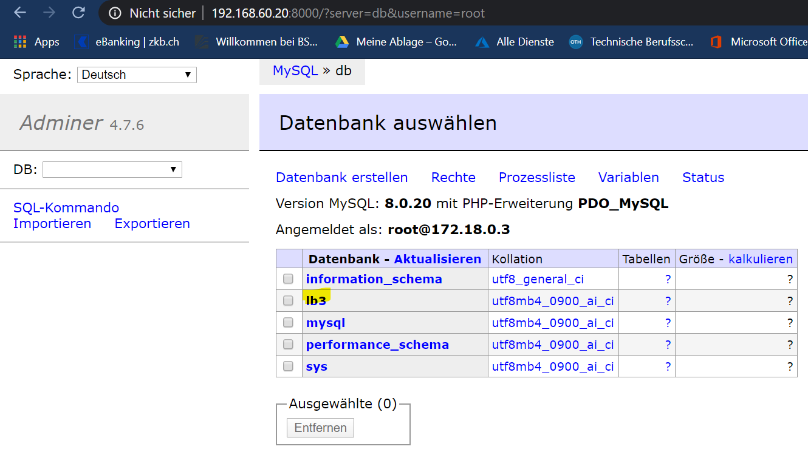

# Dokumentation LB3
## Modul300
**Modul 300:** Plattformübergreifende Dienste in ein Netzwerk integrieren

**Autor:** Sarah Gisiger

**Datum:** 08.05.20

## Anleitung
1. vagrant up
2. vagrant reload

Das war schon alles. Nun kann man die Services über den Browser anschauen. Alle Links zu den Services befinden sich zuunterst in dieser Dokumentationen unter 'Links'.

Wenn man nun den Webserver in die Registry pushen möchte, muss man folgendermassen vorgehen:
1. vagrant ssh
2. PW: vagrant
3. docker-compose push



## Allgemeines
Mein Vagrantfile habe ich so geschrieben, dass es eine VM erstellt. Für die VM habe ich 'hashicorp/bionic64' als Box verwendet.

Nachfolgend wird zuerst das Vagrantfile und anschliessend die Files zu Docker beschrieben:

### Vagrantfile
#### Fakten
>- **Box:** hashicorp/bionic64
>- **Installierte Dienste:** docker & docker-compose
>- **Synchronisierter Folder:** "." , "/home/vagrant"
>- **IP-Adresse:** 192.168.60.20

#### Weiteres
> Damit docker-compose sauber läuft, muss man als erstes 'vagrant up' eingeben, wodurch die VM erstellt & docker installiert wird. Anschliessend muss man 'vagrant reload' eingeben, damit nun auch docker-compose installiert & gestartet werden kann. Ich habe im Internet gelesen, dass dies beim **ersten Starten von Vagrant** nicht direkt funktioniert.

#### Vorgehen
> Damit bei der Eingabe von 'vagrant up' docker-compose ebenfalls mitgestartet wird, habe ich folgende Zeile mit in Vagrantfile geschrieben:
> **config.vm.provision :docker_compose , yml: "/home/vagrant/docker-compose.yml", run: "always"**

#### Code
```css
Vagrant.configure(2) do |config|
	config.vm.box = "hashicorp/bionic64"

	#hier werden div. VM Konfigurationen definiert
	config.vm.provider "virtualbox" do |vb|
		vb.memory = "1024" 
		vb.name = "M300_LB3"
		vb.cpus = 2  
	end
	
	#hier wird ein privates Netzwerk erstellt + der Hostname wird gesetzt
	config.vm.hostname = "LB3"
	config.vm.network "private_network", ip:"192.168.60.20"
  
	#hier wird der synchronisierter Folder angegeben.
	config.vm.synced_folder ".", "/home/vagrant"
	
	#Installiert Docker & Docker Compose + startet gleich das docker-compose.yml File
	config.vm.provision :docker
	config.vm.provision :docker_compose , yml: "/home/vagrant/docker-compose.yml", run: "always"
end
```

### Docker Compose
#### Fakten
>- **Dateiname:** docker-compose.yml
>- **Voraussetzung:** Docker Compose muss installiert sein
>- **Services:** registry, httpd, mysql, adminer

#### Weiteres
> Im Docker Compose File stehen alle Services drinnen. 

#### Vorgehen
> Damit man 'webserver' in die Registry pushen kann, muss man den Eintrag folgendermassen mache: 
>'image:  **localhost:5000**/webserver'

#### Code
```css
version: '3'
services:

  registry:
    image: registry
    ports:
    - "5000:5000"
    #in diesem Verzeichnis werden die Daten für die Registry gespeichert
    environment:
      REGISTRY_STORAGE_FILESYSTEM_ROOTDIRECTORY: /data
    #dafür wird ebenfalls ein Volume erstellt
    volumes:
      - ./data:/data

  web:
    #'localhost:5000' wird benötigt wenn man diesen Container ins Registry schieben möchte
    image: localhost:5000/webserver
    #in diesem Pfad liegt das Dockerfile & index.html
    build: ./web
    container_name: webserver
    restart: always
    ports:
      - "8080:80"
    volumes:
      - ./public_html/:/var/www/html/

  db:
    image: mysql
    #hier wird das root Passwort gesetzt & es wird eine DB namens 'lb3' erstellt
    environment:
      MYSQL_ROOT_PASSWORD: Test123
      MYSQL_DATABASE: lb3
    ports:
      - "3306:3306"

  admin:
    #durch adminer kann man MySQL im Browser öffnen
    image: adminer
    ports:
      - "8000:8080"
```

### Dockerfile
#### Fakten
>- **Dateiname:** Dockerfile
>- **Voraussetzung:** docker muss installiert sein
>- **Service:** httpd
>- **Standort:** ./web

#### Weiteres
> Das Dockerfile wird benötigt um httpd zu installieren. Zudem befindet sich die index.html Datei im selben Verzeichnis wie das Dockerfile.


#### Vorgehen
> Zuerst habe ich das Dockerfile erstellt und anschliessend dann den entsprechenden Eintrag ins docker-compose.yml geschrieben.

#### Code 
##### Dockerfile
```css
#wird von Docker Hub heruntergeladen
FROM httpd

#Apache wird installiert
RUN apt-get update \
   && apt-get install -y apache2

#das index.html wird an die entsprechende Stelle kopiert
COPY index.html /var/www/html/
WORKDIR /var/www/html
CMD ["apachectl", "-D", "FOREGROUND"]

#der Port 80 wird dafür bereitgestellt
EXPOSE 80
```

#### Code 
##### HTML
```css
<h1>It works!</h1>
```

## Bilder








## Links zu Docker Hub
[https://hub.docker.com/_/registry](https://hub.docker.com/_/registry)

[https://hub.docker.com/_/httpd](https://hub.docker.com/_/httpd)

[https://hub.docker.com/_/mysql](https://hub.docker.com/_/mysql)

[https://hub.docker.com/_/adminer](https://hub.docker.com/_/adminer)

## Links

 [Link zur Index-Seite](http://192.168.60.20:8080/) 
 
 [Link zur Registry](http://192.168.60.20:5000/v2/_catalog)

[Link zur DB](http://192.168.60.20:8000/)